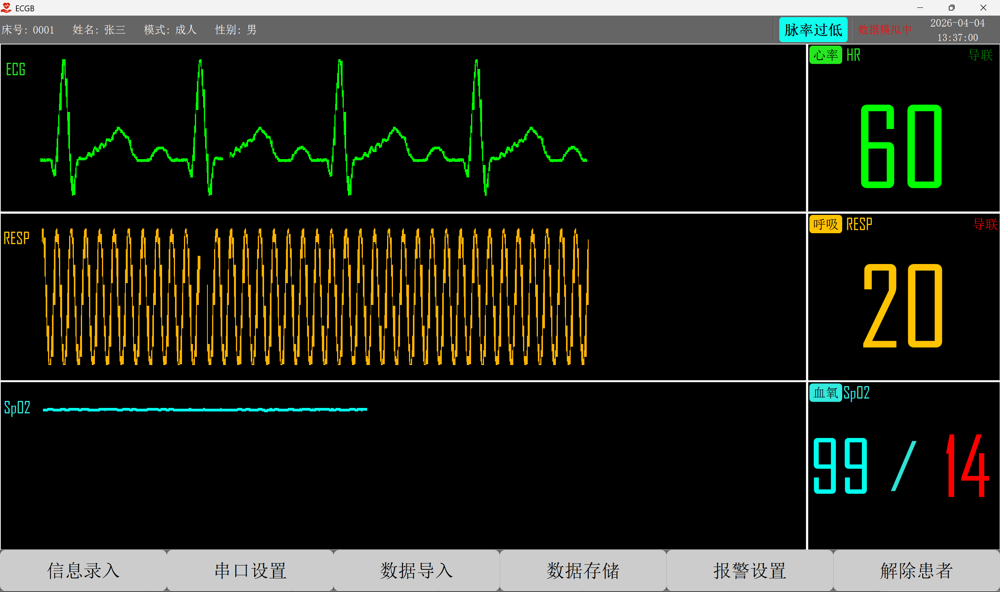

# ECGB

[](https://www.python.org/) [](https://doc.qt.io/qtforpython/) [](LICENSE)

ECGB 是一个基于 **Python + PySide2** 开发的生命监护仪上位机软件，用于接收、解析、显示和保存监护设备上传的数据。  
当前项目支持对以下生理参数进行实时监测与展示：

- **ECG**：心电波形
- **RESP**：呼吸波形 / 呼吸率
- **SpO2**：血氧波形 / 血氧饱和度
- **PR**：脉率
- **报警提示**：阈值越界时声音报警与界面闪烁提示
- **数据回放**：支持导入历史数据文件进行模拟显示
- **串口通信**：支持通过串口连接设备进行实时采集

---

## 项目简介

本项目定位为医疗监护设备的桌面端监测软件，适合以下场景：

- 连接下位机设备，实时显示生命体征数据
- 录入患者基本信息并根据年龄模式设置默认报警阈值
- 保存采集到的原始数据，供后续分析或回放
- 导入历史数据文件，模拟设备在线运行效果

界面采用典型监护仪布局，左侧显示三路波形，右侧显示核心数值参数，底部提供常用操作按钮。

---

## 主要功能

### 1. 患者信息录入
可录入并显示患者基础信息，包括：

- 姓名
- 床号 / ID
- 性别
- 模式

当前代码中内置了多种模式，用于自动设置不同年龄段的报警阈值：

- 成人
- 新生儿
- 婴儿
- 幼儿
- 学龄前
- 学龄
- 青少年

---

### 2. 串口连接与实时采集
软件支持通过串口与监护设备通信，可配置：

- 串口号
- 波特率
- 数据位
- 停止位
- 校验位

连接成功后，程序会周期性读取串口缓冲区数据，并进行协议解包和数据分发处理。

---

### 3. 实时波形显示
软件可实时绘制：

- 心电波形（ECG）
- 呼吸波形（RESP）
- 血氧波形（SpO2）

特点：

- 黑色背景监护仪风格
- 不同通道使用不同颜色绘制
- 按接收到的数据持续滚动刷新

---

### 4. 实时数值监测
界面右侧会实时显示以下参数：

- 心率（HR）
- 呼吸率（RESP）
- 血氧饱和度（SpO2）
- 脉率（PR）

---

### 5. 报警功能
支持阈值报警：

- 心率过高 / 过低
- 呼吸过快 / 过慢
- 血氧过低
- 脉率过高 / 过低

当参数超出设定范围时，软件会：

- 播放报警音
- 将对应数值闪烁显示
- 在状态栏中提示当前异常状态

---

### 6. 阈值设置
可通过“报警设置”界面自定义以下阈值：

- 心率上限 / 下限
- 呼吸率上限 / 下限
- 血氧下限
- 脉率上限 / 下限

录入患者模式后，程序也会自动加载对应的默认阈值。

---

### 7. 数据存储
支持将接收到的监护数据保存到本地文件。  
保存文件名包含患者信息和时间戳，便于归档和回放，例如：

- `张三_m_0_2025-06-11_07-07-35.txt`

保存目录默认为：

- `Data/`

---

### 8. 历史数据导入与模拟
支持从本地导入已保存的 `.txt` 数据文件进行模拟显示。  
这对于以下用途很有帮助：

- 演示系统效果
- 离线调试界面
- 数据回放与验证

---

## 界面预览



---

## 技术栈

- **Python 3.10+**
- **PySide2**
- **pyserial**
- Qt 多媒体模块（用于报警音播放）

---

## 项目结构

```text
ECGB/
├─ index.py                # 程序入口
├─ MainWindow.py           # 主界面与主要业务逻辑
├─ PackUnpack.py           # 设备通信协议打包/解包
├─ CK_Dialog.py            # 串口设置对话框
├─ Info_Dialog.py          # 患者信息录入对话框
├─ BJ_Dialog.py            # 报警阈值设置对话框
├─ Load_Dialog.py          # 数据导入对话框
├─ ui_MainWindow.py        # 主界面 UI 转换文件
├─ ui_CK_Dialog.py         # 串口设置 UI 转换文件
├─ ui_Info_Dialog.py       # 信息设置 UI 转换文件
├─ ui_BJ_Dialog.py         # 报警设置 UI 转换文件
├─ ui_Load_Dialog.py       # 数据导入 UI 转换文件
├─ MainWindow.ui
├─ CK_Dialog.ui
├─ Info_Dialog.ui
├─ BJ_Dialog.ui
├─ Load_Dialog.ui
├─ ECGB.ico                # 程序图标
├─ alarm.mp3               # 报警音频
├─ Data/                   # 数据保存目录
├─ assert/
│  └─ example.png          # 项目截图
├─ pyproject.toml
└─ README.md
```

---

## 安装与运行

### 1. 克隆项目

```bash
git clone <your-repo-url>
cd ECGB
```

### 2. 安装依赖

建议使用虚拟环境。

```bash
pip install PySide2 pyserial
```

如果你使用的是 `uv`，也可以按自己的习惯安装依赖。

---

### 3. 启动程序

```bash
python index.py
```

---

## 使用说明

### 实时采集流程

1. 启动程序
2. 点击 **信息录入**
3. 填写患者姓名、ID、性别和模式
4. 点击 **串口设置**
5. 选择正确的串口参数并打开串口
6. 开始实时接收并显示监护数据
7. 如需保存数据，点击 **数据存储**

---

### 历史数据回放流程

1. 启动程序
2. 点击 **数据导入**
3. 选择历史 `.txt` 数据文件
4. 程序将按记录内容进行模拟显示

---

## 通信协议说明

项目中包含一个 `PackUnpack` 类，用于处理数据协议的打包与解包。

### 协议特点

- 包 ID 范围：`0x00 ~ 0x7F`
- 固定包长：`10` 字节
- 包内包含：
  - 模块 ID
  - 数据头
  - 二级 ID
  - 数据区
  - 校验和

### 当前处理的数据模块

从主窗口逻辑来看，当前至少处理了以下模块类型：

- `0x10`：ECG 数据
- `0x11`：RESP 数据
- `0x13`：SpO2 数据

不同二级 ID 用于区分波形、状态、数值等不同信息。

---

## 数据文件格式

保存的数据以文本形式逐行写入，每一行是一个列表，例如：

```text
[16, 2, 1, 100, 0, 0, 0, 0]
[17, 3, 0, 20, 0, 0, 0, 0]
[19, 3, 0, 99, 0, 0, 0, 0]
```

这些数据可被重新导入，用于离线模拟显示。

---

## 默认阈值逻辑

程序会根据患者模式自动加载默认阈值。例如：

### 成人
- HR：60 ~ 100
- RESP：12 ~ 24
- SpO2：>= 94
- PR：60 ~ 100

### 新生儿
- HR：100 ~ 160
- RESP：30 ~ 60
- SpO2：>= 92
- PR：120 ~ 160

### 婴儿
- HR：90 ~ 150
- RESP：30 ~ 50
- SpO2：>= 92
- PR：80 ~ 140

### 幼儿
- HR：70 ~ 110
- RESP：25 ~ 40
- SpO2：>= 94
- PR：80 ~ 130

### 学龄前
- HR：65 ~ 110
- RESP：20 ~ 34
- SpO2：>= 94
- PR：75 ~ 120

### 学龄
- HR：60 ~ 95
- RESP：18 ~ 30
- SpO2：>= 94
- PR：60 ~ 100

### 青少年
- HR：60 ~ 100
- RESP：12 ~ 20
- SpO2：>= 94
- PR：60 ~ 100

---

## 开发说明

### UI 文件
项目使用 Qt Designer 设计界面，并将 `.ui` 文件转换为 Python 文件使用。  
通常不建议直接手改 `ui_*.py` 文件，因为重新生成时会覆盖。

### 核心逻辑位置
如果你准备二次开发，建议优先阅读以下文件：

- `MainWindow.py`：界面控制、串口读取、数据显示、报警逻辑
- `PackUnpack.py`：通信协议处理
- `Info_Dialog.py` / `CK_Dialog.py` / `BJ_Dialog.py` / `Load_Dialog.py`：各类交互弹窗

---

## 已知注意事项

1. `pyproject.toml` 中当前未完整声明运行依赖，实际运行仍需要手动安装：
   - `PySide2`
   - `pyserial`

2. 项目目前更适合在 **Windows** 环境下运行与测试。

3. 数据文件名格式与患者信息绑定，导入历史数据时建议保持原始命名规则。

4. 报警音文件 `alarm.mp3` 需与程序保持相对路径一致，否则可能无法播放报警提示音。

---

## 适用场景

- 医疗设备上位机课程设计
- 生理参数监护系统演示
- 串口通信与波形显示练习项目
- Qt / PySide2 桌面应用开发参考

---

## License

- Apache-2.0

---
